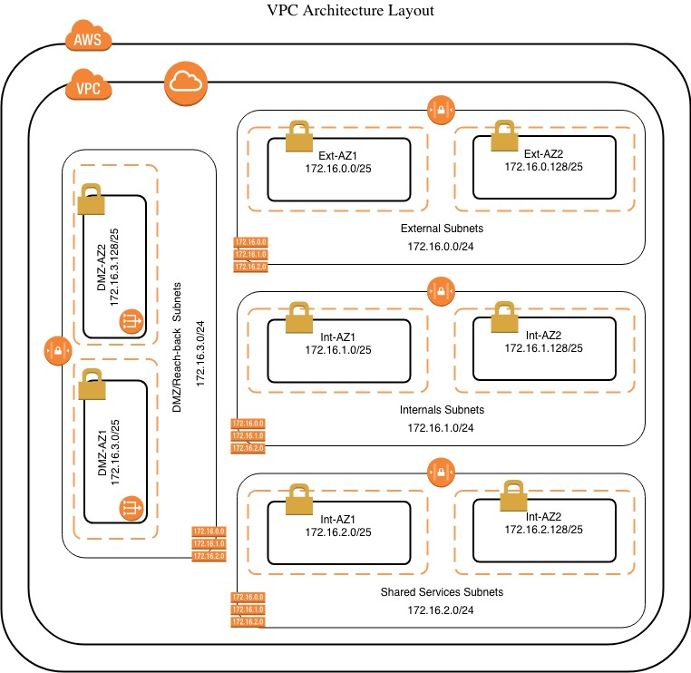

# AWS VPC Module

This Module builds a basic VPC architecture as showed in the reference diagram but you can add or remove subnets by modifiying the _variables.tf_ file.

## Architecture Diagram

## Requirements

| Name | Version |
|------|---------|
| terraform | >= 0.12 |

## Providers

| Name | Version |
|------|---------|
| aws | n/a |

## Inputs

| Name | Description | Type | Default | Required |
|------|-------------|------|---------|:--------:|
| az\_list | Define the number of AZ for each subnet block | `list` | <pre>[   "us-east-1a",   "us-east-1b" ]</pre> | no |
| custom\_vpc | Set to true or false whether you want a new VPC to be created | `bool` | `true` | no |
| default\_vpc | Set to true or false whether you want to use the default VPC | `bool` | `false` | no |
| env\_name | Environment name -reqired- | `string` | `"Dev"` | no |
| nat\_gw\_subnet | Name of the subnet block where you want the nat gateway gets deployed | `string` | `"External"` | no |
| public\_ip | Bool list as per it relates to subnets\_names list | `list` | <pre>[   true,   false,   false,   true ]</pre> | no |
| subnets\_cidr | List of cidr ranges to be used in the subnets creation | `list` | <pre>[   "172.16.0.0/25",   "172.16.0.128/25",   "172.16.1.0/25",   "172.16.1.128/25",   "172.16.2.0/25",   "172.16.2.128/25",   "172.16.3.0/25",   "172.16.3.128/25" ]</pre> | no |
| subnets\_names | List with the name of the subnet blocks | `list` | <pre>[   "External",   "Internal",   "Shared_Services",   "Reach_Back" ]</pre> | no |
| vpc\_cidr | VPC CIDR Range | `string` | `"172.16.0.0/16"` | no |

## Outputs

| Name | Description |
|------|-------------|
| nacl\_ids | List of the NACL's id |
| rtbl\_ids | List of the Route table's id |
| subnets\_id | List of the subnet's id |
| vpc\_default\_id | Default VPC id |
| vpc\_id | Custom VPC id |

